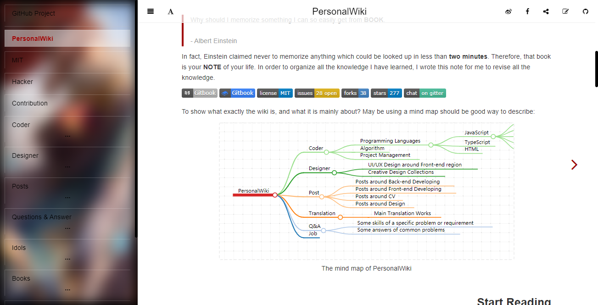

## gitbook-mindmaps

A GitBook plugin for generating mindmaps with Markdown, and see the [**Demo**](https://wiki.aleen42.com/#about) directly.

   

  [](https://raw.githubusercontent.com/aleen42/gitbook-mindmaps/master/LICENSE) [](https://www.npmjs.com/package/gitbook-plugin-mind-maps)



### Installation

Add the following plugins to your `book.json` and run the command `gitbook install`

```json
{
	"plugins": ["mind-maps"]
}
```

### Usage

1. Generate mind maps with Markdown headings syntax:

    ````markdown
    ```mind:height=300,title=a mind map of something,color
    # 1
    ## 1.1
    ### 1.1.1
    ## 1.2
    # 2
    # 3
    ```
    ````

    - **height** (optional): to specify the map height
    - **title** (optional): to specify a title for this map
    - **color** (optional): to generate a colorful map

2. Generate with Markdown list items syntax:

    ````markdown
    ```mind
    - 1
      - 1.1
        - 1.1.1
      - 1.2
    - 2
    - 3
    ``` 
    ````

### TODO

- [x] ~~Use unlimited headings for generating mind maps~~
- [x] ~~Support HTML tags~~

### Release History

* ==================== **1.0.0 Initial release** ====================
 	* 1.0.4 bug fix
 	* 1.0.5 fix empty line
 	* 1.0.8 style enhancement
 	* 1.0.9 support custom border color
    * 1.1.0 remove nested restriction in remarkable [#1](https://github.com/aleen42/gitbook-mindmaps/issues/1)
    * 1.1.4 support HTML tags [#2](https://github.com/aleen42/gitbook-mindmaps/issues/2)
    * 1.1.7 use gitbook-color to support light or dark theme
    * 1.1.9 import eslint

### :fuelpump: How to contribute

Have an idea? Found a bug? See [how to contribute](https://wiki.aleen42.com/contribution.html).

### :scroll: License

[MIT](https://wiki.aleen42.com/MIT.html) © aleen42

